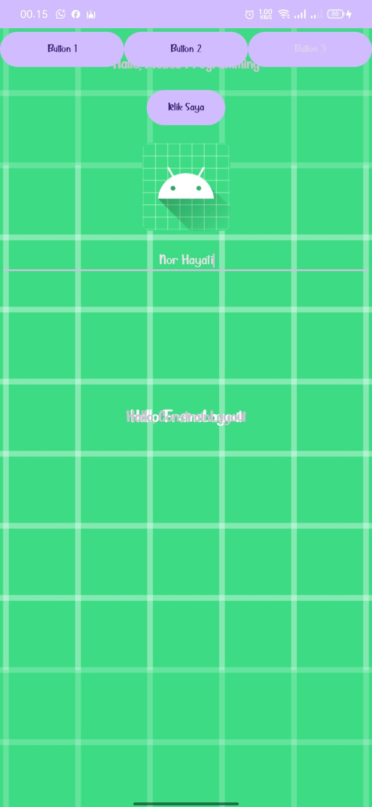
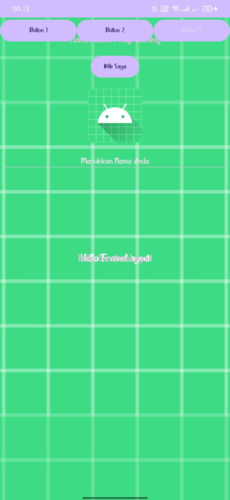
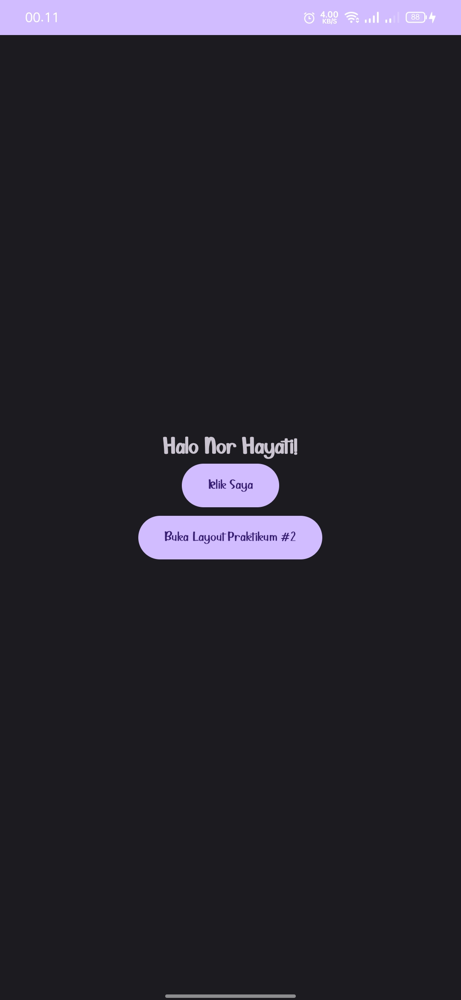
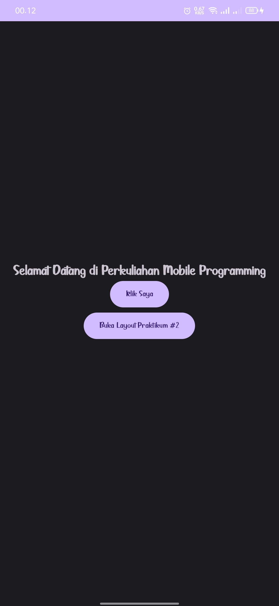
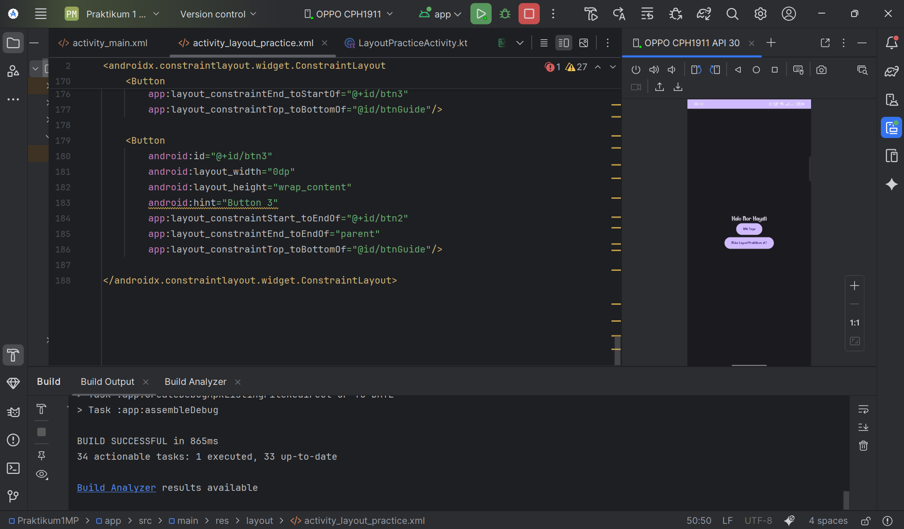
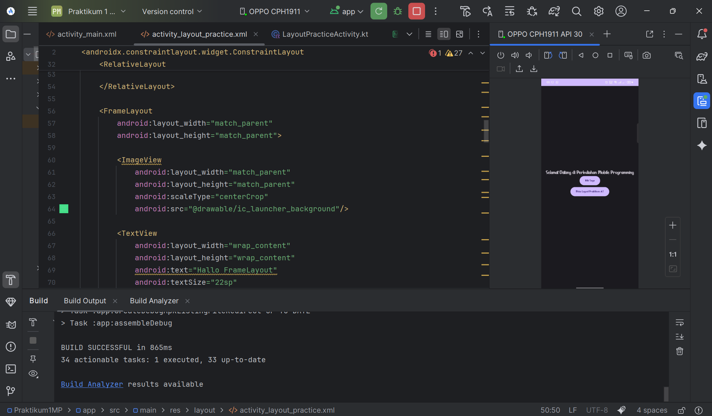
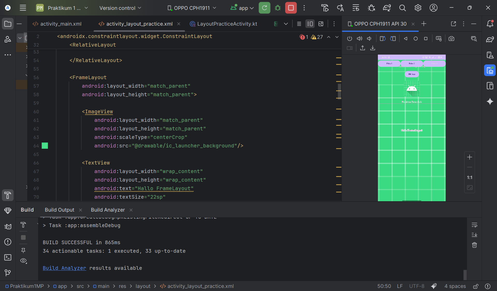
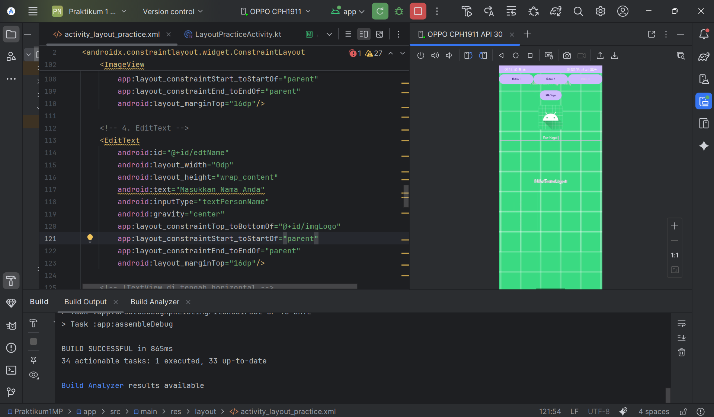

# Praktikum 1-2 – Mobile Programming 
## Pengenalan Android Studio dan Project Android

---

## 👤 Identitas Mahasiswa
- **Nama**  : **NOR HAYATI**
- **NIM**   : **230104040203**
- **Kelas** : **TI23A**
- **Mata Kuliah** : **Mobile Programming**
- **Praktikum** : **Praktikum 1-2**

---

Repository ini berisi hasil **Praktikum 1-2 Mata Kuliah Mobile Programming** yang bertujuan untuk mengenal **Android Studio**, memahami **struktur dasar project Android**, serta menjalankan **aplikasi Android sederhana**.

---

## 🎯 Tujuan Praktikum
- Mengenal lingkungan pengembangan Android Studio
- Memahami struktur dasar project Android
- Membuat dan menjalankan project Android pertama
- Melakukan pengujian aplikasi menggunakan emulator atau perangkat Android
- Menggunakan Layout dan Views dasar
- Mendesain UI Android yang responsif dan user-friendly

---

## 🛠️ Perangkat & Teknologi
- **Android Studio**
- **Java / Kotlin**
- **Android SDK (Minimal API 24)**
- **Emulator Android / Smartphone**
- **Git & GitHub**

---

## 📁 Struktur Project
```bash
.
├── .gradle/
├── .idea/
├── .kotlin/
├── app/
├── gradle/
├── hasiluji/
│ ├── 1.jpg
│ ├── 2.jpg
│ ├── 3.jpg
│ ├── 4.jpg
│ ├── 5.png
│ ├── 6.png
│ ├── 7.png
│ ├── 8.png
│ ├── 9.jpg
│ ├── 10.jpg
│ ├── 11.jpg
│ ├── 12.png
│ ├── 13.png
│ ├── 14.png
  └── 15.png
├── .gitignore
├── build.gradle.kts
├── gradle.properties
├── gradlew
└── README.md
```

---

---

## ⚙️ Langkah Praktikum

### Praktikum 1 – Pengenalan Android Studio
### Langkah Praktikum
- Install Android Studio
- Install Android SDK
- Membuat project Android baru
- Membuat emulator Android

### Hasil Praktikum 1
- Project berhasil dibuat tanpa error
- Struktur project Android dipahami
- Aplikasi dapat dijalankan dengan baik di emulator

---

### Praktikum 2 – Desain UI Android (Layout & ConstraintLayout)
### Materi Praktikum
- Layout Android
  - Install Android Studio
  - Install Android SDK
  - Membuat project Android baru
  - Membuat emulator Android
- Views Dasar 
    - TextView
    - Button
    - ImageView
    - EditText
- ConstraintLayout
    - Constraint ke 4 sisi
    - Margin
    - Guideline
    - Bias
    - Chain
- Mini Project UI
  Membuat Welcome Screen sederhana dengan komponen:
- Judul aplikasi (TextView)
- Logo aplikasi (ImageView)
- Input nama pengguna (EditText)
- Tombol “Mulai” (Button)
  Desain dibuat responsif menggunakan ConstraintLayout.


### 2️⃣ Menjalankan Aplikasi
1. Buka project menggunakan **Android Studio**
2. Pilih **Emulator Android**
3. Klik tombol **Run (▶)**
4. Aplikasi berjalan pada emulator

---

## 🧪 Hasil Uji Aplikasi
Pengujian aplikasi dilakukan menggunakan **Android Studio** dan **Emulator Android**.  
Berikut adalah hasil pengujian yang diperoleh:

### 1️⃣ Tampilan Project di Android Studio


### 2️⃣ Struktur Project Android


### 3️⃣ Proses Build Project


### 4️⃣ Build Berhasil Tanpa Error


### 5️⃣ Emulator Android Berjalan


### 6️⃣ Aplikasi Berhasil Dijalankan


### 7️⃣ Tampilan Awal Aplikasi


### 8️⃣ Tampilan Aplikasi pada Emulator


### 9️⃣ Aplikasi Berjalan Stabil


### 🔟 Tampilan UI Aplikasi


### 1️⃣1️⃣ Proses Running Aplikasi


### 1️⃣2️⃣ Tampilan Aplikasi Saat Digunakan


### 1️⃣3️⃣ Aplikasi Berjalan Normal


### 1️⃣4️⃣ Pengujian Berhasil


### 1️⃣5️⃣ Hasil Akhir Praktikum



---

## ✅ Kesimpulan
Berdasarkan pelaksanaan Praktikum 1 dan Praktikum 2 Mata Kuliah Mobile Programming (MP20251), mahasiswa telah berhasil memahami dasar pengembangan aplikasi Android, mulai dari penggunaan Android Studio, struktur project, hingga proses build dan running aplikasi.

Selain itu, mahasiswa juga telah mampu merancang antarmuka aplikasi Android dengan menggunakan berbagai Layout, Views dasar, serta ConstraintLayout untuk menghasilkan tampilan yang responsif dan user-friendly. Praktikum ini memberikan pengalaman praktis yang menjadi fondasi penting dalam pengembangan aplikasi Android yang lebih kompleks pada tahap selanjutnya. 
---

