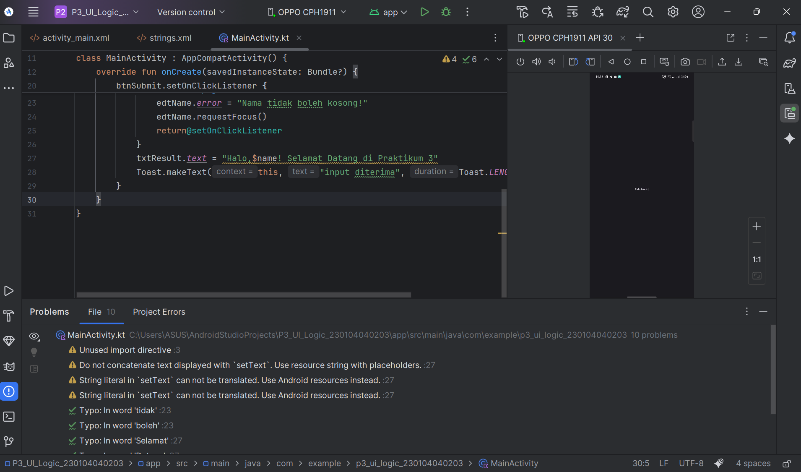
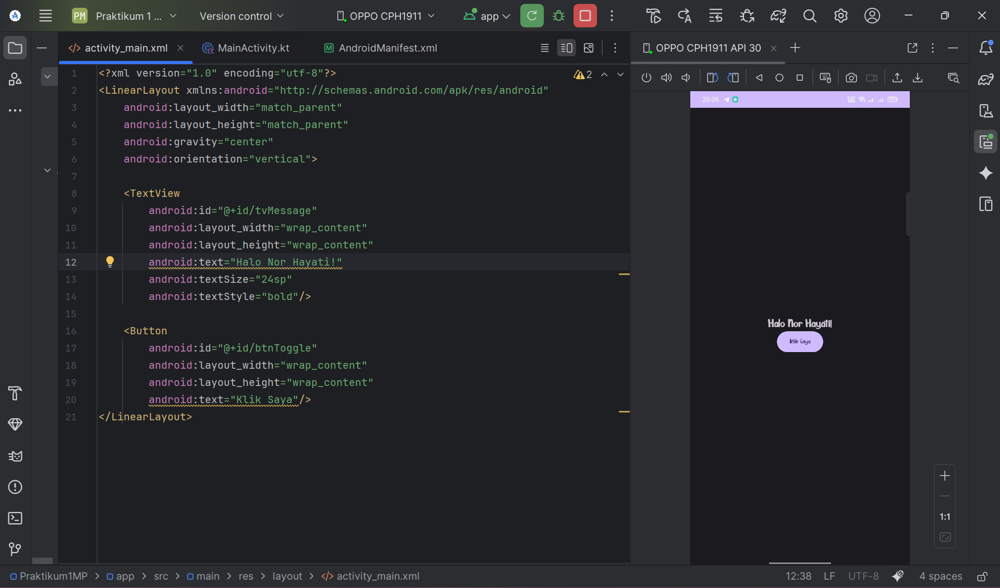
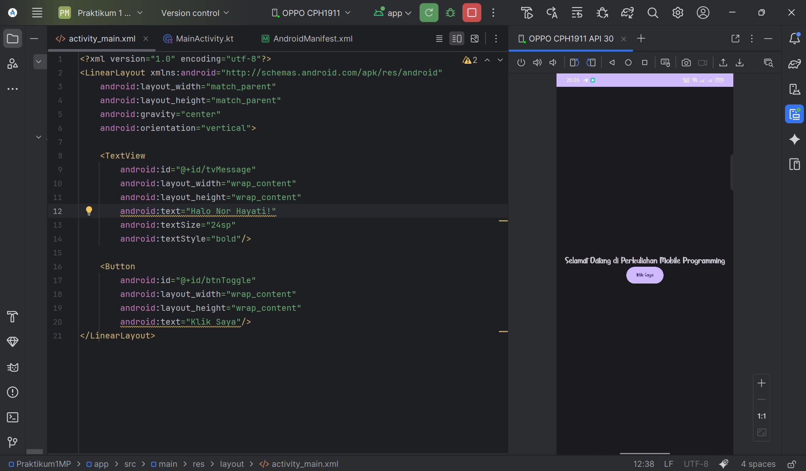

# Praktikum 1 – Mobile Programming (MP20251)
## Pengenalan Android Studio dan Project Android

---

## 👤 Identitas Mahasiswa
- **Nama**  : **NOR HAYATI**
- **NIM**   : **230104040203**
- **Kelas** : **TI23A**
- **Mata Kuliah** : **Mobile Programming**
- **Kode MK** : **MP20251**
- **Praktikum** : **Praktikum 1**

---

Repository ini berisi hasil **Praktikum 1 Mata Kuliah Mobile Programming (MP20251)** yang bertujuan untuk mengenal **Android Studio**, memahami **struktur dasar project Android**, serta menjalankan **aplikasi Android sederhana**.

---

## 🎯 Tujuan Praktikum
- Mengenal lingkungan pengembangan Android Studio
- Memahami struktur dasar project Android
- Membuat dan menjalankan project Android pertama
- Melakukan pengujian aplikasi menggunakan emulator atau perangkat Android

---

## 🛠️ Perangkat & Teknologi
- **Android Studio**
- **Java / Kotlin**
- **Android SDK**
- **Emulator Android / Smartphone**
- **Git & GitHub**

---

## 📁 Struktur Project
```bash
.
├── .gradle/
├── .idea/
├── .kotlin/
├── app/
├── gradle/
├── hasiluji/
│ ├── 1.jpg
│ ├── 2.jpg
│ ├── 3.jpg
│ ├── 4.jpg
│ ├── 5.png
│ ├── 6.png
│ └── 7.png
├── .gitignore
├── build.gradle.kts
├── gradle.properties
├── gradlew
└── README.md
```

---

## ⚙️ Langkah Praktikum

### 1️⃣ Persiapan
- Install Android Studio
- Install Android SDK
- Membuat emulator Android

---

### 2️⃣ Menjalankan Aplikasi
1. Buka project menggunakan **Android Studio**
2. Pilih **Emulator Android**
3. Klik tombol **Run (▶)**
4. Aplikasi berjalan pada emulator

---

## 🧪 Hasil Uji Aplikasi

### 1️⃣ Tampilan Project di Android Studio


---

### 2️⃣ Proses Build Project


---

### 3️⃣ Emulator Berhasil Dijalankan


---

### 4️⃣ Tampilan Awal Aplikasi


---

### 5️⃣ Tampilan Aplikasi Berjalan


---

### 6️⃣ Aplikasi Berjalan Tanpa Error


---

### 7️⃣ Pengujian Berhasil


---

## ✅ Kesimpulan
Berdasarkan pelaksanaan **Praktikum 1 Mata Kuliah Mobile Programming (MP20251)**, dapat disimpulkan bahwa mahasiswa telah berhasil memahami tahapan awal dalam pengembangan aplikasi Android. Praktikum ini memberikan pemahaman dasar mengenai penggunaan **Android Studio** sebagai lingkungan pengembangan, mulai dari pembuatan project, pengenalan struktur folder, hingga proses build aplikasi.

Selain itu, mahasiswa juga telah mampu menjalankan aplikasi Android sederhana menggunakan **emulator Android** tanpa mengalami kendala berarti. Proses pengujian menunjukkan bahwa aplikasi dapat dijalankan dengan baik dan menampilkan tampilan awal sesuai dengan konfigurasi project yang dibuat.

Melalui praktikum ini, mahasiswa memperoleh pengalaman langsung dalam mengoperasikan Android Studio, memahami alur kerja pengembangan aplikasi Android, serta melakukan pengujian awal aplikasi. Hasil praktikum ini diharapkan dapat menjadi dasar yang kuat untuk memahami materi praktikum selanjutnya yang lebih kompleks pada mata kuliah Mobile Programming.

---

